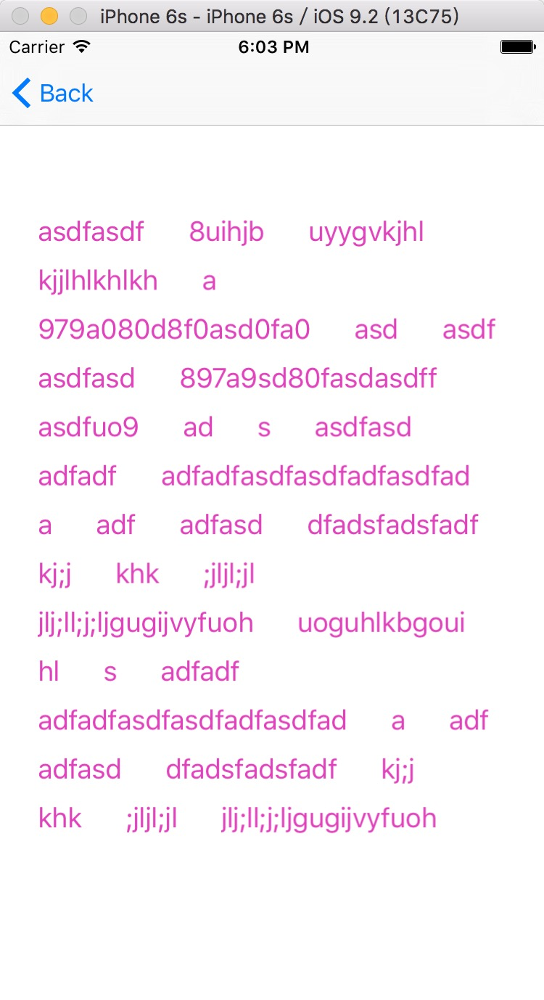

# JumpCell

###几个测试的例子

* 类似阿里旅行活动的弹动cell
* 扩散动画，类似雷达波
* 标签选择控件
* n级菜单，可无限级

***
***

<br><br>
#### 标签选择器展示

***
***
<br><br>
#### 多级菜单的展示
可以无限级的点击下去，使用起来也很简单。

* 测试代码

```
    // 新建一个测试的菜单的数据源
    NSArray *datasource = @[
                            @"a",
                            @"b",
                            @{
                                @"c" : @[
                                      @"f",
                                      @"g",
                                      @"h",
                                      @{
                                          @"i" : @[
                                                  @{
                                                    @"j" : @[
                                                          @"q",
                                                          @"t",
                                                          @"r",
                                                          @"s",
                                                          @{
                                                              @"a" : @[
                                                                    @"b",
                                                                    @"c",
                                                                    @{
                                                                        @"s" : @[
                                                                              @"g",
                                                                              @"h",
                                                                              @"j",
                                                                              @"k",
                                                                              @{
                                                                                  @"z" : @[
                                                                                        @"x",
                                                                                        @"c",
                                                                                        @"b",
                                                                                        @{
                                                                                            @"v" : @[
                                                                                                    @"n"
                                                                                                    ]}
                                                                                        ]}
                                                                              ]},
                                                                    @"d",
                                                                    @"e"
                                                                    ]}
                                                          ]},
                                                @"k",
                                                @"l",
                                                @"m"
                                                ]}
                                      ]},
                            @"d",
                            @"e",
                            @"q",
                            @"w",
                            @"e",
                            @"r",
                            @"t",
                            @"y"
                            ];
    
    // 初始化
    AUUStepMenu *stepMenu = [[AUUStepMenu alloc] initWithFrame:CGRectMake(0, 100, self.view.bounds.size.width, 300)
                                                 andDatasource:datasource];
    // 设置点击结果的回调接收
    [stepMenu menuSelectedCompletion:^(NSArray *currentDatasource,
                                       NSInteger index,
                                       BOOL hadAdditionalMenu) {
        NSLog(@"%@随后的菜单, 当前的菜单是%@",
                            hadAdditionalMenu ? @"还有" : @"没有",
                            hadAdditionalMenu ? [[[currentDatasource objectAtIndex:index] allKeys] firstObject] :
                                                [currentDatasource objectAtIndex:index]);
    }];
    
    // 添加到要显示的页面上
    [self.view addSubview:stepMenu];
```
可以看到，所有的都是`数组`和`字典`的组合。
##注意
* 字典的key是作为当前项的菜单名
* 字典的value暂时必须是数组，作为下级菜单的数据源，否则将无法解析。


***
***

<br><br>
#### 从下往上跳动一下的cell，扩散的简单动画
