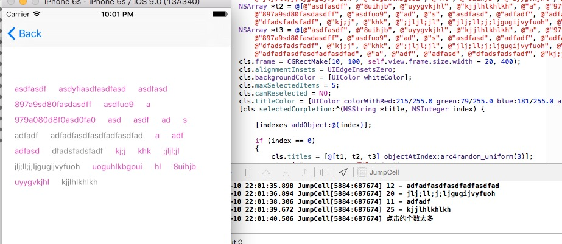
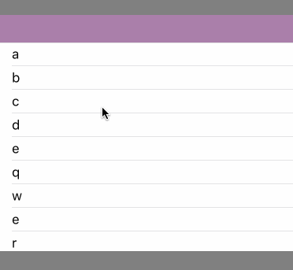
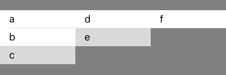
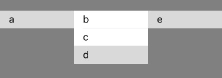
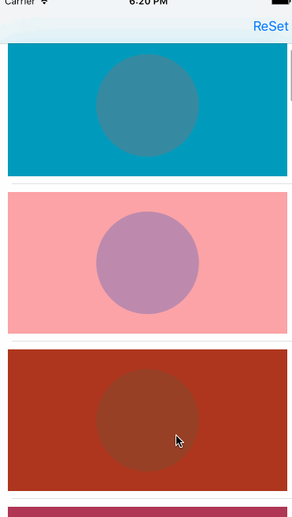

# JumpCell

###几个测试的例子

* 类似阿里旅行活动的弹动cell
* 扩散动画，类似雷达波
* 标签选择控件
* n级菜单，可无限级
<br>

***
***

<br>
#### 标签选择器展示

* `maxSelectedItems`：设置最多的选取个数，当超过设置的个数时就无法再点击；
* `canReselected`：`BOOL`类型，可以设置一个标签是否可以重复选择；
* `titleColor`：设置标签的颜色；
* `titleFont`：设置标签的字体；
* `alignmentInsets`：设置每个标签上下左右的间距

**如果是简单的数据类型的，即所有标签都只是数组，可以直接通过属性的设置方法就可以**
**如果每个标签是来自复杂的字典或model，则可以通过代理的方式实现**

<br>

***
***

<br><br>
#### 多级菜单
可以 **无限级** 的点击下去，使用起来也很简单。
* **测试1**

```
    // 新建一个测试的菜单的数据源
    NSArray *datasource = @[
                            @"a",
                            @"b",
                            @{
                                @"c" : @[
                                      @"f",
                                      @"g",
                                      @"h",
                                      @{
                                          @"i" : @[
                                                  @{
                                                    @"j" : @[
                                                          @"q",
                                                          @"t",
                                                          @"r",
                                                          @"s",
                                                          @{
                                                              @"a" : @[
                                                                    @"b",
                                                                    @"c",
                                                                    @{
                                                                        @"s" : @[
                                                                              @"g",
                                                                              @"h",
                                                                              @"j",
                                                                              @"k",
                                                                              @{
                                                                                  @"z" : @[
                                                                                        @"x",
                                                                                        @"c",
                                                                                        @"b",
                                                                                        @{
                                                                                            @"v" : @[
                                                                                                    @"n"
                                                                                                    ]}
                                                                                        ]}
                                                                              ]},
                                                                    @"d",
                                                                    @"e"
                                                                    ]}
                                                          ]},
                                                @"k",
                                                @"l",
                                                @"m"
                                                ]}
                                      ]},
                            @"d",
                            @"e",
                            @"q",
                            @"w",
                            @"e",
                            @"r",
                            @"t",
                            @"y"
                            ];
    
    // 初始化
    AUUStepMenu *stepMenu = [[AUUStepMenu alloc] initWithFrame:CGRectMake(0, 100, self.view.bounds.size.width, 300)
                                                 andDatasource:datasource];
    // 设置点击结果的回调接收
    [stepMenu menuSelectedCompletion:^(NSArray *currentDatasource,
                                       NSInteger index,
                                       BOOL hadAdditionalMenu) {
        NSLog(@"%@随后的菜单, 当前的菜单是%@",
                            hadAdditionalMenu ? @"还有" : @"没有",
                            hadAdditionalMenu ? [[[currentDatasource objectAtIndex:index] allKeys] firstObject] :
                                                [currentDatasource objectAtIndex:index]);
    }];
    
    // 添加到要显示的页面上
    [self.view addSubview:stepMenu];
```

<br>
可以看到，所有的都是`数组`和`字典`的组合。
<br>
* **测试2：**
```
    NSArray *t2 = @[
                    @"a",
                    @"b",
                    @{
                        @"c"  : @[
                                @"d",
                                @{
                                    @"e" : @"f"
                                    }
                                ]}
                    ];
```

<br>
* **测试3：**
```
    NSDictionary *t3 = @{
                         @"a" : @[
                                 @"b",
                                 @"c",
                                 @{
                                     @"d" : @"e"
                                     }
                                 ]};
```

<br>
**注意**
<br>
* **字典的key是作为当前项的菜单名。**
* **字典的value如果是数组，则作为下级菜单的数据源；如果是字符串，则作为下级菜单的名字。**
<br>

***
***

<br>
#### 从下往上跳动一下的cell，扩散的简单动画

